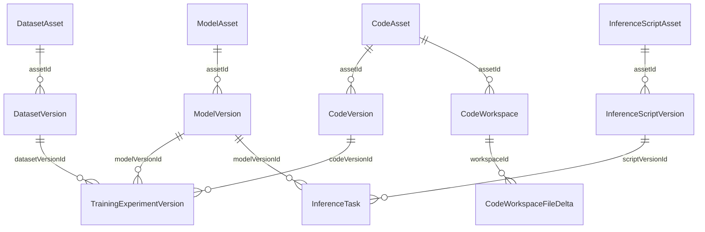
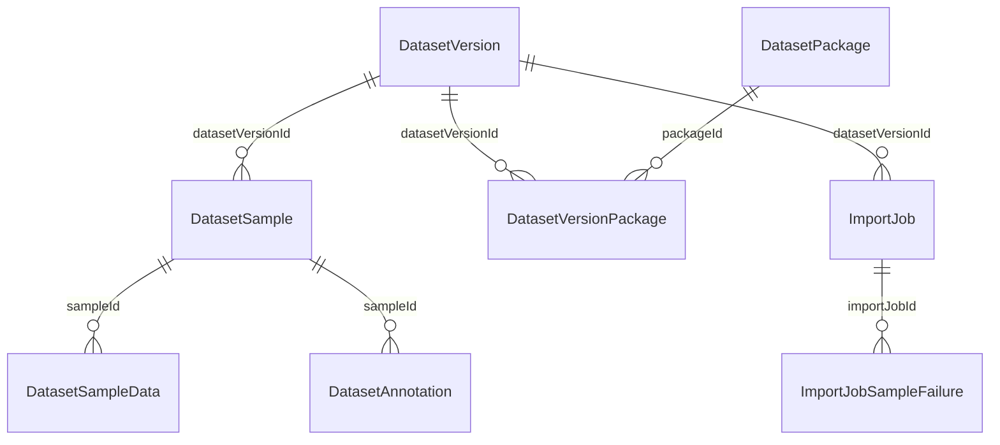
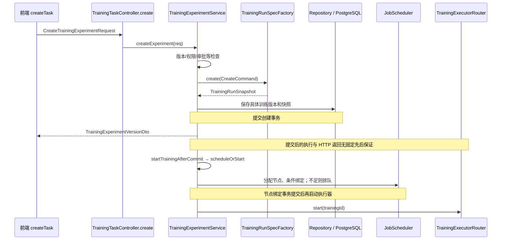
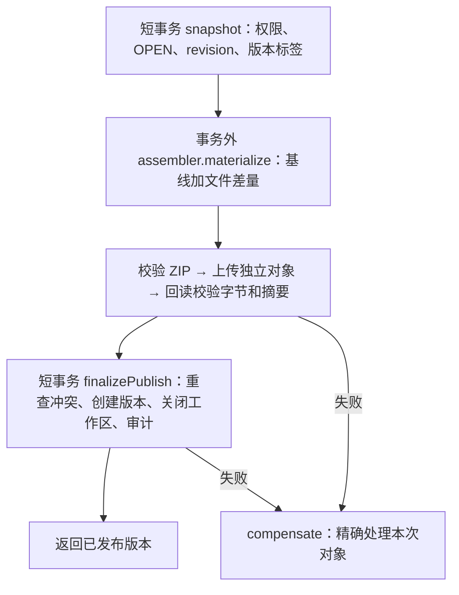

# 后端代码级设计说明

核对日期：2026-09-10；源代码基线 `30dda00`。J 表示 `backend/src/main/java/com/tss/platform/`，B 表示本仓库根。本文的流程是对关键函数体的静态核对，运行时业务验收另见治理 SOP。

配套：[实体字段字典](实体字段字典.md)、[请求与运行结构字典](请求与运行结构字典.md)、[函数与依赖索引](函数与依赖索引.md)。实体字典覆盖实体目录全部 42 个源文件，含复合键类及非持久化字段；不能直接说有 42 张表。Java 导航覆盖 630 个生产源文件。目录层解释见[后端架构与功能扩展指南](后端架构与功能扩展指南.md)。

## 1. 最核心的数据关系

下图画的是逻辑 ID 引用。源码多数使用字符串字段和 Repository 查询，并非每条线都对应 JPA 对象关联或数据库外键；具体约束查 SQL。

| 结构 | 核心字段与含义 | 文件 |
| --- | --- | --- |
| 模型主体 | `id/name/ownerUserId/currentVersionId`；一个主体有多个版本 | [ModelAsset](../src/main/java/com/tss/platform/entity/ModelAsset.java) |
| 模型版本 | `assetId/version/storagePath/artifactSha256/artifactSpecId/status`；文件路径、摘要和格式证据 | [ModelVersion](../src/main/java/com/tss/platform/entity/ModelVersion.java) |
| 数据集主体 | `id/type/cvTaskType/annotationFormat/currentVersionId/ownerUserId` | [DatasetAsset](../src/main/java/com/tss/platform/entity/DatasetAsset.java) |
| 数据集版本和草稿 | `assetId/versionNo/versionLabel/parentVersionId/status/workspaceRevision/workspaceHeadVersionId` | [DatasetVersion](../src/main/java/com/tss/platform/entity/DatasetVersion.java) |
| 代码主体 | `id/trainingProfile/purpose/runtime/entryScript/ownerUserId/rowVersion`；rowVersion 为 ORM 乐观锁 | [CodeAsset](../src/main/java/com/tss/platform/entity/CodeAsset.java) |
| 代码版本 | 文件摘要及独立的 `status/validationStatus/approvalStatus/riskStatus` | [CodeVersion](../src/main/java/com/tss/platform/entity/CodeVersion.java) |
| 代码编辑区 | `id/assetId/baseVersionId/closedVersionId/revision/status` | [CodeWorkspace](../src/main/java/com/tss/platform/entity/CodeWorkspace.java) |
| 编辑差量 | `workspaceId/path/operation/contentBytes/contentHash`；记录相对基线的文件变化 | [CodeWorkspaceFileDelta](../src/main/java/com/tss/platform/entity/CodeWorkspaceFileDelta.java) |
| 训练记录 | `id/experimentId/versionNo`、三种输入版本、方案/运行快照、状态、输出 | [TrainingExperimentVersion](../src/main/java/com/tss/platform/entity/TrainingExperimentVersion.java) |
| 推理记录 | 模型/脚本版本、输入模式、`currentAttempt/retryCount/paramsJson/resultJson` | [InferenceTask](../src/main/java/com/tss/platform/entity/InferenceTask.java) |

三个特别容易理解错的地方：

1. **数据集工作区复用 DatasetVersion。** `V2DatasetWorkspaceService.describe()` 把草稿版本的 id 暴露为 workspaceId，baseVersion 来自 parentVersionId。不存在一张与代码工作区相同设计的独立 DatasetWorkspace 实体表。
2. **实验是训练记录的分组。** `experimentId` 把多条 TrainingExperimentVersion 归为同一实验；`id` 指向某次具体训练。当前没有单独的 TrainingExperiment 实体承载这个分组。
3. **推理脚本独立建模。** InferenceScriptAsset/Version 与训练用 CodeAsset/Version 不同，不能直接互换版本 ID。

## 2. 数据集内部为什么还有这么多表

- `DatasetUploadSession` 管上传会话：分片大小/总数、文件指纹、上传状态、资产/版本、失败信息，以及工作区上传目标。`DatasetUploadChunk` 记录各分片。
- `DatasetPackage` 管物理数据包；`DatasetVersionPackage` 用版本 ID + 包 ID 复合键，记录某版本引用的包和包顺序。
- `DatasetSample` 是样本；`DatasetSampleData` 是样本里的数据资源；`DatasetAnnotation` 是标注，还可关联具体 sampleDataId。资源含包内路径和 ZIP 偏移等读取信息。
- `ImportJob` 保存导入进度、执行者、心跳和错误；`ImportJobSampleFailure` 保存失败样本。它们支持恢复和失败项重试。
- 这些引用让版本和草稿能够复用已有包。删除某个版本，不能无条件删除它曾引用的全部物理对象。

字段定义集中在 J 的 `entity/`，完整表名、显式列名、类型和源码行号见实体字典。

## 3. 其余数据模型如何归类

| 类组 | 设计目的 |
| --- | --- |
| `CodeValidationRun/CodeApprovalRecord` | 校验和审批证据绑定具体代码版本、artifactSha256、策略版本；审批不是只改一个布尔值 |
| `CodeRiskAssessment/CodeRiskFinding/CodeAssetAuditLog` | 风险评估、发现项、跨用户管理审计 |
| `TrainingPlanDefinitionEntity` | 在线方案的 ID/版本、YAML、摘要、发布/停用记录；解析后进入 TrainingPlanRegistry |
| `User/Role/UserApiPolicy` | 用户、角色以及分业务的接口开关/并发额度；主要通过 MyBatis Mapper 读写 |
| `OperationLog/AuditRecord/DatasetWorkspaceAuditLog` | 不同业务的操作及审计记录；查询需保留角色/本人范围 |
| `ComputeServer/ServerMetricSnapshot/ServerMetricHistory` | 节点配置、当前指标和历史指标；节点使用 serverIp 与 k8sNodeName 等标识 |
| `SchedulerLock` | 后台任务的多实例互斥 |
| `PlatformSystemConfig` | 平台级配置值 |
| `MinioDeleteTask` | 等待删除的对象及失败重试；逻辑删除和物理删除可分开完成 |

资产所有权通常为 Integer user ID，业务资产/版本/任务多为 String ID，方案由 planId + planVersion 标识。不能把所有 ID 都转成同一种含义。

## 4. 函数链一：创建训练 → 调度 → 执行

源码入口：[TrainingTaskController.create](../src/main/java/com/tss/platform/controller/TrainingTaskController.java)、[TrainingExperimentService](../src/main/java/com/tss/platform/service/TrainingExperimentService.java)、[TrainingRunSpecFactory](../src/main/java/com/tss/platform/training/plan/TrainingRunSpecFactory.java)、[JobScheduler](../src/main/java/com/tss/platform/service/JobScheduler.java)。

`createExperiment()` 实际会：校验 code/dataset/plan/model 输入；解析 baseModelVersionId 别名；`CodeVersionService.requireApprovedForTraining()` 获取可消费代码制品；创建 experimentId 和具体版本 id；调用快照工厂；保存 `pending` 记录；登记提交后启动。

`startTrainingAfterCommit()` 的 afterCommit 使用独立线程进入 `scheduleOrStart()`，避开刚提交事务仍绑定的旧 EntityManager。`scheduleOrStart()` 在事务里调用 `assignNodeForTraining()`、`bindTask()` 或 `enqueueTask()`；绑定成功并提交后才调用执行器。`dispatchQueuedTasks()` 处理后续排队任务。

`TrainingExecutorRouter.start()` 按任务选执行器，`KubernetesTrainingExecutor.start()` 启动线程进入 `submitJob()`，构造 Kubernetes Job 并通过 workload client 提交。旧无 profile 路径保留本地执行；带 profile 的任务不会因为 Kubernetes 不可用而静默改成本地训练。

## 5. TrainingRunSpec 是连接 Java 与 Python 的关键契约

[TrainingRunSpec](../src/main/java/com/tss/platform/training/plan/TrainingRunSpec.java) 是不可变 record，顶层包含：

| 部分 | 保存什么 |
| --- | --- |
| `schemaVersion/trainingId/createdAt` | 协议版本、具体任务身份和生成时间 |
| `plan/trainingMode` | 使用哪个方案版本和训练模式 |
| `inputs.model/dataset/code` | 各版本 ID、对象位置、SHA256、大小、格式；代码另含入口、审批证据和依赖摘要 |
| `execution` | 命令参数数组 argv、工作目录 |
| `parameters` | 经过方案默认值/校验解析后的超参数 |
| `runtime/resources` | 镜像与摘要、CPU/GPU/内存要求、节点选择 |
| `workspace` | 模型、数据、代码、配置、输出目录和 paramsFile |
| `outputs/security` | 输出格式要求和执行限制 |

工厂 `create()` 读取启用的方案、验证模型/数据/代码的所有权和规范、解析参数与资源，生成 `TrainingRunSnapshot`。`applyRunSnapshot()` 把 JSON、摘要、输入摘要、审批记录、镜像等固化到 TrainingExperimentVersion。旧任务因此不会随在线方案更新悄悄换配置。

Python [train.py](../../k8s/training-worker/train.py) 的主链是 `main()` → `run()` → `load_run_spec()` / `prepare_workspace()` / 输入准备 → `write_parameters()` → `execute_training()` → `upload_outputs()` / `load_metrics()` → `CallbackReporter.report()`。用户程序输出的 `TSS_EVENT` 由 `parse_training_event()` 解析，MlflowLogger 记录指标。详细函数行号可在源文件搜索。

实验新版本由 `TrainingExperimentController.createVersion()` → `TrainingExperimentService.createVersion()` 创建，新生成具体版本 id 和递增 versionNo；缺字段按已有规则继承，再重新校验和生成快照。“继续实验”并不保证训练模式一定是微调，实际以请求与方案解析结果为准。

## 6. 函数链二：训练结果回报与模型发布

内部凭证过滤器 → `InternalTrainingCallbackController.updateResult()` → `TrainingExperimentService.updateResultInternal()` → 按状态分支处理 → 保存。

`updateResultInternal()` 在事务中用普通 `findById()` 读取并检查终态：多数终态回调直接返回；已经 success 但尚未产出模型的重复 success 回调，允许补输出证据和发布信息。非终态调用 `applyResult()` 处理进度、输出、日志和错误，运行快照任务通过 `TrainingOutputValidator` 校验输出。`prepareModelPublish()` 准备产出模型发布状态；模型发布调度器最终调用 `TrainingModelPublishService.publishIfPending()` 等方法。

训练记录现通过 `lockRevision/@Version` 拒绝旧快照覆盖，直接更新 SQL 也递增修订号。停止操作在事务外调用执行器，再用短事务 `stopIfActive()` 条件更新并读回最新结果；已结束任务保留原结果，成功回调仍可按既有规则补齐产物。并发冲突返回 HTTP 409，Worker 沿原重试协议处理。真实集群停止时序需要另外验收。

创建入口先进入 `TrainingSubmissionGuard.createOnce()`。新页面传 `submissionKey`，服务按调用用户、创建范围和编号生成摘要；同次提交重放返回原训练编号，参数冲突拒绝。回执与任务在同一事务提交，删除后的迟到重试不重建任务。续训先取得同实验的 PostgreSQL 事务锁，再读取最新版本并分配递增号。对应迁移为 `V66__training_submission_and_revision.sql`，未传编号的旧客户端保持原创建协议。

任务列表由 `searchLatestExperiments()` 在数据库选择每个实验的最新版本，再按用户、状态、名称/实验编号筛选和分页。新页面传 `current/pageSize`，旧客户端不传分页仍可读取完整最新记录列表；不会先分页历史版本再丢掉其中非最新的记录。

训练的 `status` 与 `modelPublishStatus` 分开：计算完成后，产出文件成为平台可用模型还可能有单独的发布处理或失败信息。前端不能只看训练 success 就假定模型已经入库。

## 7. 函数链三：数据集上传与导入

旧/V2 上传 Controller → V2DatasetUploadService 适配（对应 V2 路径）→ [DatasetUploadService](../src/main/java/com/tss/platform/service/DatasetUploadService.java) 的 `init/saveChunk/getProgress/complete`。

`complete()` 按实际输入分支到：

- **单模态 `completeSingleModalUpload()`：** 检查分片 → 事务 `reserveSingleModalVersion()` 占位 → 事务外 `objectStore.compose()`、格式校验和索引准备 → `finalizeSingleModalUpload()` 落库 → 登记分片清理。失败时按占位结果回滚，并精确清理本次对象。
- **Manifest 导入 `completeManifestUpload()`：** 分片检查与 `reserveManifestVersion()` → 合并对象 → `finalizeManifestUpload()` → `launchPendingImport()`，后者经 `ImportJobLauncher.launch()` 启动后续导入；有活动事务时安排提交后启动。
- **ImportJobService.execute()：** 条件抢占 pending job 并记录 executorId → 加载上下文/读取 ZIP → `buildPlan()` → `persistPlan()`；失败映射为结构化原因并更新状态。重试场景保留样本失败信息与 PARTIAL 处理。

上传百分比只是传输进度。ImportJob 的 `SUCCESS`、版本的 `READY` 和上传的 `COMPLETED` 是不同对象上的字段；追加工作区数据的导入完成还要遵循草稿发布规则。

## 8. 函数链四：数据集工作区发布

前端 `publishDatasetWorkspace(workspaceId, expectedWorkspaceRevision)` → `V2DatasetWorkspaceController.publish()` → [V2DatasetWorkspaceService.publish](../src/main/java/com/tss/platform/service/V2DatasetWorkspaceService.java)。

该方法先识别已发布结果的重复请求；否则 `DatasetWorkspaceCommandService.lockForMutation()` 检查所属资产、状态及 revision，`DatasetWorkspaceReadinessService.evaluate()` 检查发布条件，再调用 [DatasetWorkspacePublishService.publish](../src/main/java/com/tss/platform/service/DatasetWorkspacePublishService.java)。

底层发布锁住资产和草稿记录，校验基线、包、导入、样本/资源关系，清理草稿中已删除内容的引用，保存 `READY/publishedAt/fileCount` 并更新资产 currentVersionId，记录审计。这里主要是同一发布事务中的数据库变化；不能照搬代码 ZIP 发布的事务外上传流程。

`workspaceRevision` 防止旧页面覆盖新修改；`workspaceHeadVersionId` 和父版本关系用于判断工作区基线是否已经过期。两种冲突应分别保留。

## 9. 函数链五：训练代码草稿发布与审批

前端 `publishCodeWorkspaceDraft()` → V2 请求 → `V2CodeWorkspaceController.publish()` → [CodeWorkspacePublishService.publish](../src/main/java/com/tss/platform/service/CodeWorkspacePublishService.java)。

同一代码包的版本状态、校验记录、风险评估、审批记录各自保存。`CodeApprovalService.decide()` 等方法需要核对当前制品摘要与校验证据；训练时 `CodeVersionService.requireApprovedForTraining()` → `CodeArtifactResolver.resolve()` 再确认可消费版本。不能只把 approvalStatus 改成 APPROVED 就认为整条准入已完成。

代码校验接口 `trainingCheck()` 会刷新校验证据并检查方案；它虽使用 GET，也不是可无限自动重试的纯读取。

## 10. 函数链六：推理创建、重试、结果

`InferenceTaskController.create()` → [InferenceTaskService.createTask](../src/main/java/com/tss/platform/service/InferenceTaskService.java)：校验模型和脚本、按 inputMode 校验单对象或数据集版本、解析 params 与资源规格，保存 `pending/currentAttempt=1/retryCount=0`，提交后启动。

`InferenceExecutorRouter.start(taskId, attempt)` → Repository 的 `claimForSubmission()`：只有 ID、attempt、pending/queued 状态匹配才改为 scheduled；成功占位后，在事务外进入 KubernetesInferenceExecutor。抢占失败则不重复提交。

worker [infer_worker.py](../../k8s/inference-worker/infer_worker.py)：`main()` → 准备输入/脚本/模型 → `run_user_script()` → `read_result()` 读取 result.json → `upload_outputs()` → `callback()`。该文件还承载模型缓存准备、检查和清理模式；改推理运行不能忽视共享的缓存逻辑。

`retryTask()` 只允许失败且未达到上限的任务，重新验证依赖后增加 currentAttempt 和 retryCount，清理当前结果/错误/时间等字段，提交后停止旧轮次、启动新轮次。

`InternalInferenceCallbackController.updateResult()` → `updateResultInternal()` 通过 `findByIdForUpdate()` 锁定记录 → `shouldIgnoreCallback()`：忽略错误 attempt、重试后缺 attempt、终态和倒退状态回调；允许的回调再由 `applyResult()` 更新。推理保留 attempt 的目的，就是避免“上一次失败任务的迟到消息改坏本次结果”。

## 11. 模型、权限、监控等其余链路

| 功能 | 函数关系与结构 |
| --- | --- |
| 模型上传完成 | `ModelUploadService.complete()` → 事务 `prepareCompletionPlan()` → `composeAndValidateModelObject()` → `persistCompletedModel()` → 分片清理；失败精确清理并恢复会话状态 |
| 模型版本消费 | ModelVersionLifecycleService/ModelArtifactAttestationService 与 Repository 配合，检查 READY、文件存在及规范证据；训练/推理再次检查引用 |
| 正式登录 | `module1.UserController.login()` → `UserServiceImpl.login()` → MyBatis 查询、BCrypt 或短信验证、Sa-Token 登录；Controller 记录认证/审计 |
| API 权限 | `PermissionInterceptor.preHandle()` → 登录/角色与用户策略；`UserApiFeatureClassifier.classify()` 归类 URL；业务 Service 继续检查 owner/审批/状态 |
| 资源监控 | ResourceMonitorController → ResourceMonitorService；ServerMetricsCollector 写入快照/历史；JobScheduler 用节点和任务资源信息进行调度 |
| 模型缓存 | ModelCacheAdministrationService/ModelCachePolicyService → Kubernetes 管理任务 → inference worker 的缓存模式；缓存卷命名见 modelcache 包 |
| 在线训练方案 | TrainingPlanAdministrationController → TrainingPlanAdministrationService → YAML 解析/校验、数据库版本、TrainingPlanRegistry 在线快照 |
| 对象删除 | 业务删除登记 MinioDeleteTask → 删除调度器/Service → MinIO；失败记录重试，不把删除请求返回等同于对象已全部消失 |
| 文件下载 | FileObject/NativeDownloadTicket Controller → 授权及票据服务 → MinIO；范围读取和过期票据都影响预览/下载 |

具体类依赖的字段（例如 `repo: TrainingExperimentVersionRepository`）、方法和体内调用名称可在函数索引定位。Java 索引没有解析 Spring 代理、Lombok 自动方法、继承、重载和动态派发；表中读过函数体的关键链路优先作为设计说明。

## 12. 状态与改动检查

| 对象 | 当前状态维度 / 关键值 | 改动时一起检查 |
| --- | --- | --- |
| 资产版本 | DRAFT、READY、DEPRECATED、ARCHIVED；数据草稿另有 ABANDONED 等状态 | 准入、列表/详情、删除、引用及 SQL 值域 |
| 代码工作区 | OPEN、PUBLISHED、ABANDONED，加 revision | 文件编辑、发布、重复请求和冲突 |
| 导入 | PENDING、RUNNING、SUCCESS、PARTIAL、FAILED、SUPERSEDED | 心跳、恢复、失败项重试和草稿可发布性 |
| 训练/推理 | pending、queued、scheduled、running、success、failed、stopped 等各自允许状态 | 调度占位、停止、回调、页面显示；并非每次都经过全部中间状态 |
| 推理轮次 | currentAttempt/retryCount/maxRetries | 旧回调、重试上限、输入重新校验、旧 Job |
| 产出模型 | modelPublishStatus 与训练 status 分离 | 模型是否真正入库可用、重试和错误显示 |

状态集合最终以各 Service、Repository 条件更新和数据库约束为准，不能只在前端新增一个文字标签。新增字段也要从 DTO → Service → 实体/查询 → SQL → 响应逐层追踪；执行参数还要进入运行快照和 worker。
