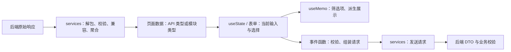
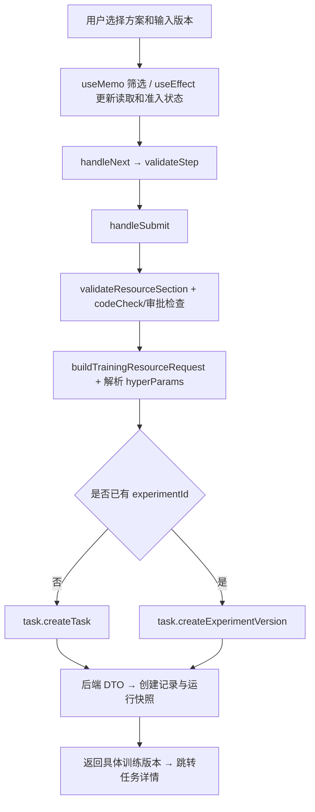
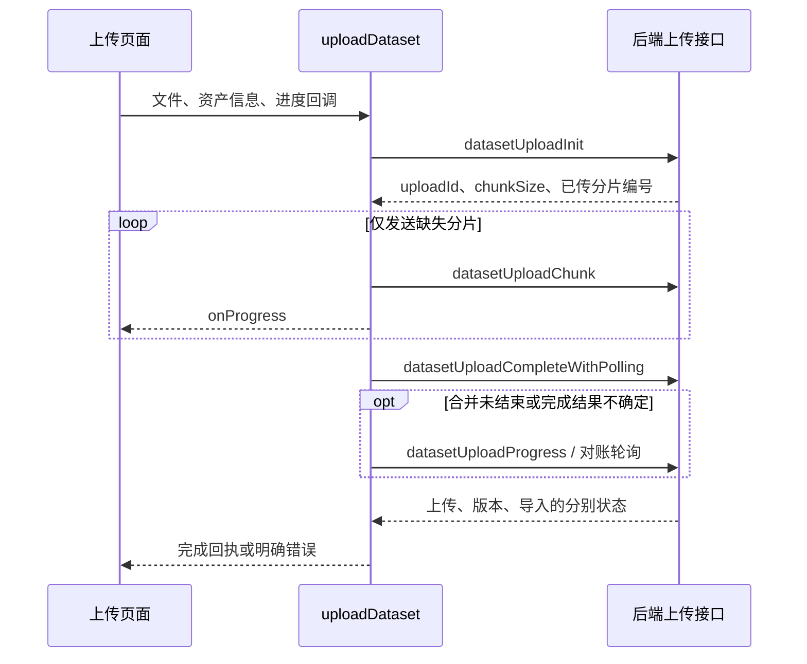

# 前端代码级设计说明

核对日期：2026-09-10。源代码基线 `523e5a0`。本文按实际函数体说明数据怎样进入页面、怎样变化、怎样提交。目录级地图见[前端架构与功能扩展指南](前端架构与功能扩展指南.md)。

查询工具：[数据类型字典](数据类型字典.md)收录 313 个显式 type/interface 声明；[函数与依赖索引](函数与依赖索引.md)覆盖 `src/`、`config/` 的 240 个源文件，列出函数、回调、项目内依赖和源码行号。类型数量包含页面局部类型；函数索引包含匿名回调，不宜用数量判断复杂度。测试与生成代码不在该索引中。

## 1. 数据经过哪些形态

同一个业务对象在这些层中的形状可以不同。例如数据库的推理 `paramsJson` 是序列化文本，前端 `InferenceTask.params` 是对象；模型列表项可能把资产和版本信息合并。不能直接把数据库列名当页面字段名。

| 数据层 | 实际位置 / 结构 | 谁负责它 |
| --- | --- | --- |
| 全局用户 | [src/app.tsx](../src/app.tsx) 的 `getInitialState()`；`@@initialState.currentUser` | 应用初始化和登录成功流程更新 |
| 页面业务数据 | `API.ModelItem`、`API.DatasetDetail`、`API.TrainingExperimentVersion` 等 | services 读取，页面持有 |
| 页面输入 | Ant Design Form；选中版本、步骤、弹窗等 useState | 页面事件处理函数 |
| 派生数据 | `useMemo()` 产生候选列表、当前对象等 | 根据既有数据计算；不单独落库 |
| 异步保护 | `useRef()` 的读取序号、路由快照、活动标记 | 读取 hook / 页面负责防止迟到响应覆盖 |
| 本地恢复信息 | storage、上传会话和草稿相关工具 | 记录 token 或恢复线索；服务器状态仍需查询 |
| 请求契约 | services 中的 request body / 参数类型 | 页面组装，services 发送，后端最终验证 |

没有一个全局数据仓库保存所有业务对象；当前用户用 Umi 初始状态，多数页面各自使用 state、表单和 hook。

## 2. 核心类型如何对应后端

| 前端结构 | 关键字段 | 后端对应 / 易混点 |
| --- | --- | --- |
| `DatasetAsset` | `id/name/type` | 数据集主体；`id` 是资产编号 |
| `DatasetVersion` | `id/assetId/version/status` | 某个版本；训练使用版本 ID |
| `DatasetListItem` | `assetId/versionId/importStatus/workspaceId` | 聚合展示结构，不能当某张表的完整记录 |
| `DatasetUploadProgress` | `uploadId/totalChunks/uploadedPartIndexes/status` | 上传会话；分片完成不等于导入或发布完成 |
| `DatasetUploadCompleteResult` | `uploadStatus/versionStatus/importJobId/importStatus` | 分别描述上传、版本、导入三条状态线 |
| `V2DatasetWorkspace` | `workspaceId/datasetId/workspaceRevision/publishReadiness` | workspaceId 对应后端草稿版本 ID；revision 用于检测过期修改 |
| `V2CodeVersion` | `id/assetId/status/approvalStatus/validationStatus` | 版本状态、审批状态、校验状态分别判断 |
| `V2CodeWorkspace` | `id/baseVersionId/revision/status` | 后端独立 CodeWorkspace；不同于数据集草稿存储方式 |
| `CreateTaskRequest` | 三种输入版本、方案、资源、超参数 | 对应 `CreateTrainingExperimentRequest`；TypeScript 可选字段不代表后端业务允许缺少 |
| `API.TrainingExperimentVersion` | `id/experimentId/versionNo/status` | 一次具体训练记录、所属实验及实验内序号；id 与 experimentId 不同 |
| `CreateInferenceTaskBody` | `modelVersionId/scriptVersionId/inputMode/params` | 对应 `CreateInferenceTaskRequest`；单对象和数据集版本是两种输入模式 |
| `InferenceTask` | `currentAttempt/retryCount/result/logPath/outputPath` | 当前重试轮次和结果摘要；文件本体另走下载接口 |

类型来源：[dataset/types.ts](../src/services/dataset/types.ts)、[datasetV2.ts](../src/services/datasetV2.ts)、[trainingCode/v2Types.ts](../src/services/trainingCode/v2Types.ts)、[taskTypes.ts](../src/services/taskTypes.ts)、[inference.ts](../src/services/inference.ts)、[typings.d.ts](../src/typings.d.ts)。完整字段和组合类型见字典。

## 3. 函数链一：登录后为什么整个页面能识别用户

入口：[登录页](../src/pages/user/login/index.tsx) `handleSubmit()`。

1. 根据账号密码或短信模式组装 `API.LoginParams`，调用 [api.ts](../src/services/ant-design-pro/api.ts) 的 `login()` → `POST /api/user/login`。
2. 解析成功回执，按“自动登录”选择持久或会话存储，保存 token；调用页面的 `fetchUserInfo()` 更新当前用户。
3. 应用 `getInitialState()` 也负责获取当前用户；页面和布局通过 `@@initialState` 使用它。
4. 后续请求由 `src/app.tsx` 的 `requestInterceptors` 加 Bearer token。`errorHandler` 识别登录失效、清 token 并跳转。
5. [access.ts](../src/access.ts) 用用户角色决定前端入口；真正的权限由后端检查。

后端正式链路是 `module1.UserController.login()` → `UserServiceImpl.login()` → 密码/短信验证 → `StpUtil.login()`。前端 `ant-design-pro` 目录名是历史命名，里面正在调用正式接口。

## 4. 函数链二：创建训练

入口：[创建训练页面](../src/pages/task/create/index.tsx)；状态和操作集中在 [useTrainingCreate.tsx](../src/pages/task/create/useTrainingCreate.tsx)，步骤展示由 [TrainingCreateSteps.tsx](../src/pages/task/create/TrainingCreateSteps.tsx) 接收。

| 状态组 | 具体变量 / 函数 | 作用 |
| --- | --- | --- |
| 来源 | `experimentId/fromVersionId/presetCodeVersionId` | 决定新实验、实验新版本及预选输入 |
| 候选数据 | `modelOptions/datasetOptions/codeOptions/trainingPlans/hardwareOptions` | 提供用户可选择的资产和资源 |
| 当前选择 | `selectedBaseModelVersionId/selectedDatasetVersionId/selectedCodeVersionId/selectedTrainingPlanId` | 指向具体输入版本和方案 |
| 派生值 | `selectedModel/selectedTrainingPlan/filteredModelSelectOptions/filteredDatasetOptions` | 按方案支持条件筛选 |
| 交互过程 | `currentStep`、form、各 loading/error | 控制向导和错误提示 |
| 准入结论 | `codeCheck/selectedCodeApprovalStatus` | 页面准入提示；后端会再校验实际输入 |
| 校验与提交 | `validateStep/validateCodeStep/validateCodeSection/validateResourceSection/handleNext/handleSubmit` | 分步验证并提交 |

实际请求函数在 [task.ts](../src/services/task.ts)：`createTask()` 调 `/api/task/create`；`createExperimentVersion()` 调指定实验的新版本接口。前端发送 `baseModelVersionId`，后端按现有别名规则保存到 `modelVersionId`。CPU 用核数，内存和显存预算用 MiB。

准入有条件分支：当前选项已标为 `APPROVED` 时，effect 会直接设置页面 `codeCheck.passed`；否则调用 [approval.ts](../src/services/trainingCode/approval.ts) 的 `checkCodeVersionForTraining()`。该函数校验响应中的代码 ID、方案和 passed 字段。页面的通过状态不能代替后端 `requireApprovedForTraining()` 和 `TrainingRunSpecFactory.create()` 的最终校验；不能据此认定每次提交前一定发过完整准入请求。

## 5. 函数链三：数据集上传与续传

入口：[dataset/uploads.ts](../src/services/dataset/uploads.ts) 的 `uploadDataset()`。单文件路径如下：

`uploadedPartIndexes` 被转换为 Set 跳过已上传分片；`onUploadSession` 供页面保存恢复线索；`onMergeStatus` 区分合并阶段。多文件 CV 分支使用 `datasetUploadFolder()`；其余情况按已有格式限制处理。

底层接口存在 V2 与旧协议适配。未知回执、权限/网络/服务器错误不能被解释成成功，也不能自动重放另一套写接口。回执解析见 [datasetUploadResponse.ts](../src/services/datasetUploadResponse.ts)。

## 6. 函数链四：数据集详情与草稿

[数据集详情页](../src/pages/dataset/detail/[id].tsx) 的 `loadDetail()` → [catalog.ts](../src/services/dataset/catalog.ts) 的 `fetchDatasetDetail()`。

- `fetchDatasetDetail()` 并行调用 `getDatasetAsset()`、`listDatasetVersions()`；再按资产编号请求 `/dataset/{id}/summary` 补导入/工作区等元数据，不再依赖列表前 200 条。状态读取失败向页面报错，不能推断为没有草稿。
- `loadDetail()` 为每轮读取记录序号、路由 ID 和查询参数，成功、失败与 finally 均检查 `isCurrent()`；旧请求不能覆盖新对象。
- 需要工作区时调用 `getDatasetWorkspace()`；[datasetWorkspaceRead.ts](../src/utils/datasetWorkspaceRead.ts) 的 `requireMatchingWorkspace()` 核对资产、工作区及 revision，`workspaceReadFailure()` 区分暂时错误和明确不可访问。
- 写入或发布走 [datasetV2.ts](../src/services/datasetV2.ts) 的对应函数；`publishDatasetWorkspace(workspaceId, expectedWorkspaceRevision)` 把读取到的 revision 交给后端检查，成功后重新读取。

`workspaceRevision` 是数据草稿的修改序号；`detailReadSequence` 是浏览器请求序号。两者保护的是不同问题。

## 7. 函数链五：代码草稿发布

[trainingCode/workspace.ts](../src/services/trainingCode/workspace.ts) 的 `publishCodeWorkspaceDraft()`：

`ensureEditableCodeWorkspace()` → `getV2CodeWorkspace()` → 取 revision 和新版本标签 → `publishV2CodeWorkspace()` → 核对新版本 ID → 返回发布结果。

当前刷新工作区读取失败时，会回用已经持有的 revision；后端仍需拒绝过期发布。发布后的审核处理是独立步骤，函数名中的 autoApprove 也不能被理解为平台允许绕过当前人工审核策略。相关 V2 请求在 [v2OwnerApi.ts](../src/services/trainingCode/v2OwnerApi.ts)。

依赖方向：页面 → 上层 workspace/approval/preview 等服务 → V2 请求和内容映射。`platform.ts`、`code.ts`、`codeV2.ts` 是导出入口，不另写业务逻辑。

## 8. 其他业务函数怎样接起来

| 业务 | 主要函数关系 | 数据 / 边界 |
| --- | --- | --- |
| 模型列表与详情 | `fetchModelList()`；`fetchModelAssetDetail()`；`fetchModelDetail()` | 聚合资产/版本，ID 含义看对应适配；入口 [model.ts](../src/services/model.ts) |
| 模型上传 | `modelUploadInit/Chunk/Progress/Complete` | 上传会话与最终模型版本分别记录；同文件内仍有较多职责 |
| 训练历史 | `useExperimentVersions()` → `listExperimentVersions()` | 保存加载、错误、版本列表；不能把请求失败显示成没有历史 |
| 训练对比 | `useCompareData()` → 任务读取与指标服务 → `comparisonModel` | 任务 ID、run ID、指标序列分别处理 |
| 训练指标 | `fetchMlflowMetricHistory()` 等 → MLflow 代理 | 0、缺失点、空结果、请求错误分别处理 |
| 推理工作台 | `createInferenceTask/listInferenceTasks/getInferenceTask/stopInferenceTask/retryInferenceTask/getInferenceTaskResult` | [inference.ts](../src/services/inference.ts)；服务请求对应 Java 同名业务方法；日志与媒体另走文件服务 |
| 算力和队列 | `fetchResourceMonitorSummary/Servers/ServerDetail`；队列重排和取消函数 | [resourceMonitor.ts](../src/services/resourceMonitor.ts)；显示数据与管理员写操作分清 |
| 用户、配置、日志 | `src/services/system/` 内按业务调用 | 正式用户 DTO 与管理权限；日志需区分本人和管理员范围 |

各函数的文件、行号、项目内导入和语法调用位置都可在函数索引搜索。初次梳理为静态分析；六项维护修复后已刷新导航并执行回归，具体证据见维护索引与根工作区修复 SOP。

提交入口仍是 `useTrainingCreate.handleSubmit()`，在第一个 await 前用 `trainingSubmission.ts` 同步防连点，并管理同一表单的办理编号；`taskTypes.ts` 的可选 `submissionKey` 随两个创建分支传给后端。页面只展示提交状态，最终防重由数据库保证。任务列表的筛选和总数现由后端在分页前计算，首页统计读取 total。

## 9. 新增字段时怎么沿代码追踪

先确认字段属于资产、版本、任务还是页面临时输入；在类型字典搜索所属结构，再沿“页面表单 → 提交函数 → services 请求 → 后端 DTO”查写入，沿“后端响应 → services 映射 → 页面 state/展示”查读回。需要过滤、比较或执行时，再查相应派生值和运行快照。新增业务规则须补正常、错误、权限、过期响应/冲突及旧数据回归。
